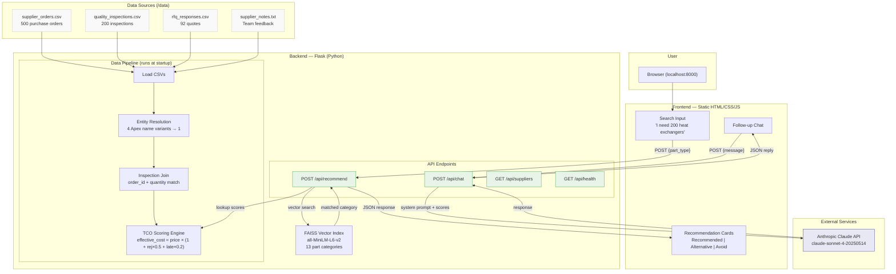
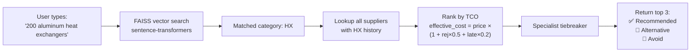
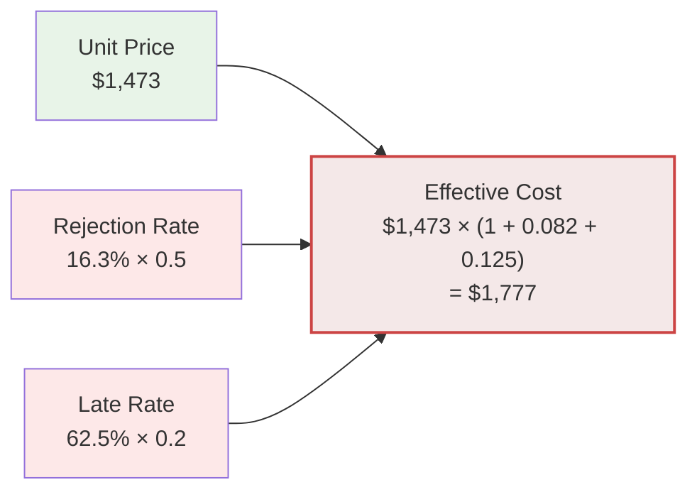

# Architecture Diagram

Paste the diagram below into [mermaid.live](https://mermaid.live) to get a shareable image (PNG/SVG).

## System Overview

## Recommendation Flow (Detail)

## TCO Formula

