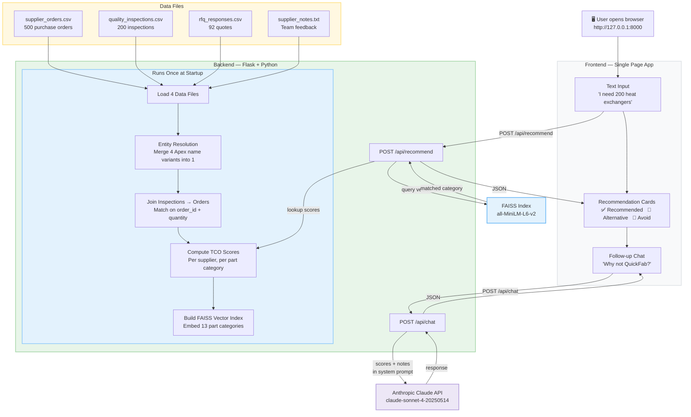
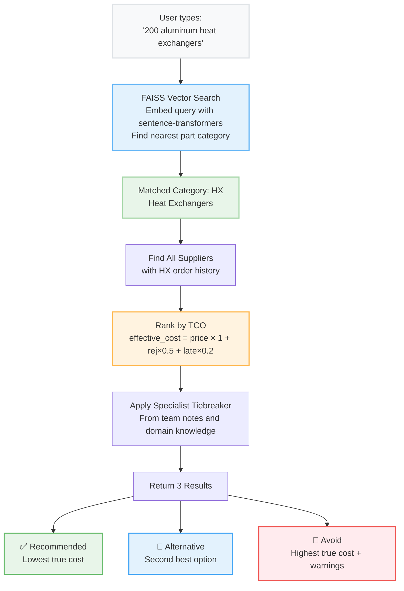
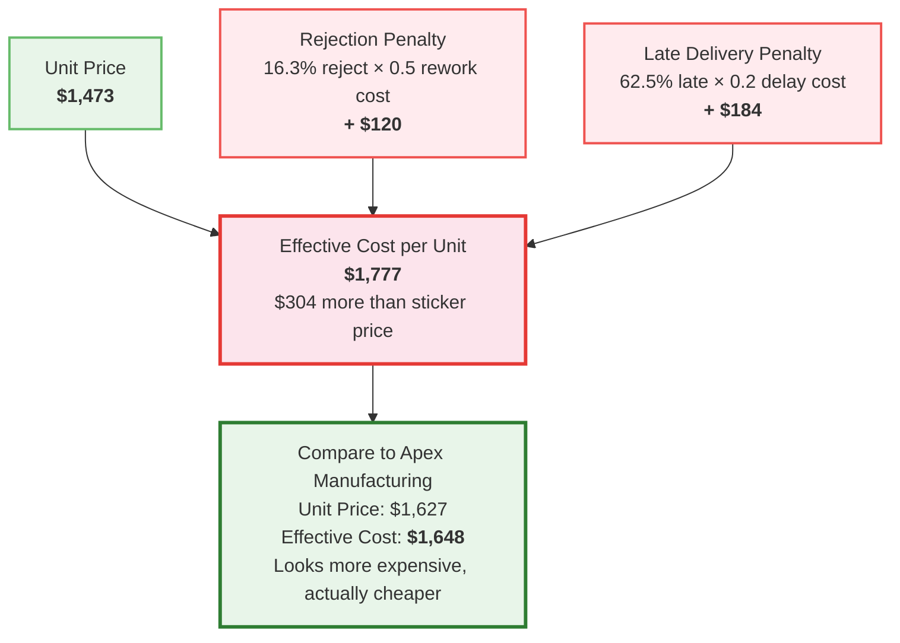

# Architecture Diagrams

Go to [mermaid.live](https://mermaid.live), paste any diagram below into the left editor, then click the PNG or SVG export button to download a shareable image.

---

## System Architecture

---

## Recommendation Flow

---

## TCO Formula Example: QuickFab on Heat Exchangers

